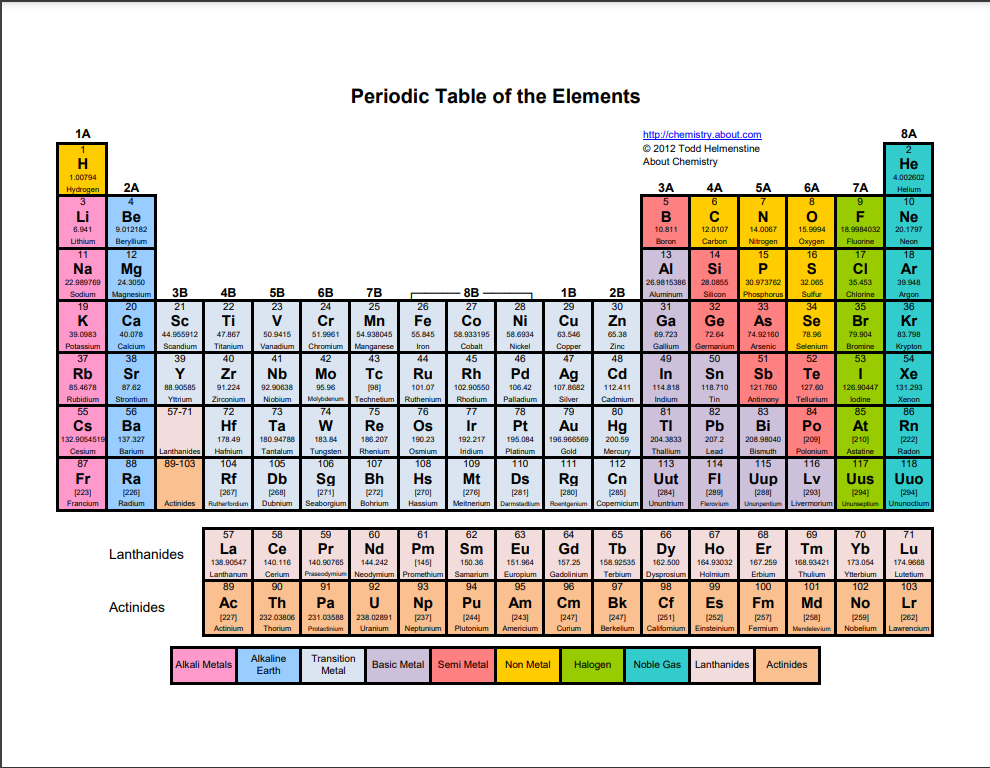
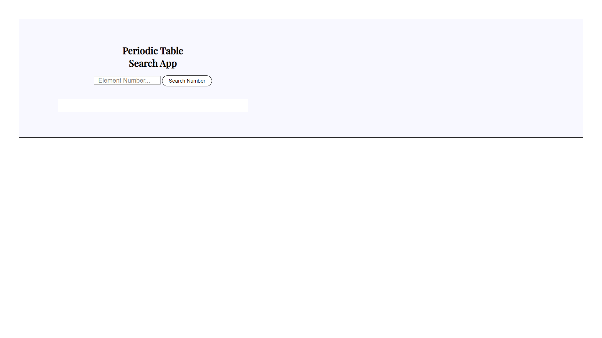
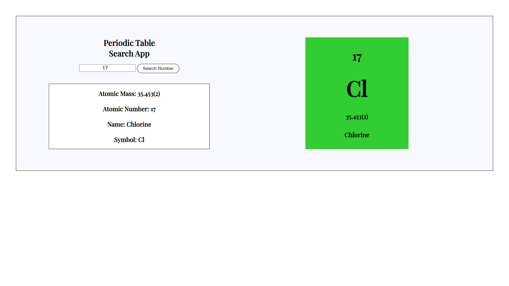
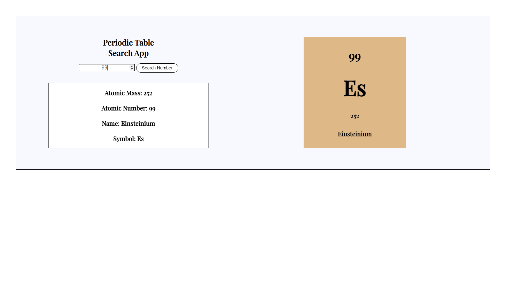

# Illyasen's Periodic Table Search App

Another chapter in the Javascript Journey

Searching an Element in the Periodic Table via Atomic Number

## UI

## Search by Atomic Number Samples

## API Used
[Periodic Table API](https://neelpatel05.pythonanywhere.com/element/atomicnumber?atomicnumber=1)

[Periodic Table API Github](https://github.com/neelpatel05/periodic-table-api)

## Credits

Creator of the Periodic Table API

[neelpatel05](https://github.com/neelpatel05)

